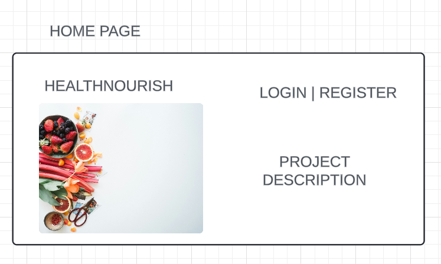
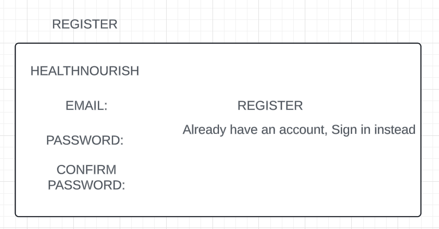
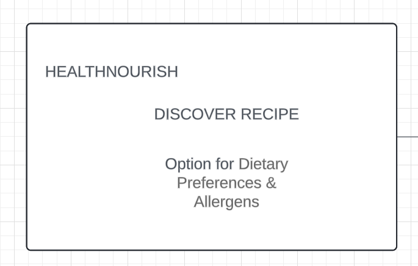

# Project Title

HealthNourish

## Overview

HealthNourish is an app designed to help users discover recipes based on their dietary preferences and health trends. The app allows users to search for recipes, save their favorites, and track their long-term health trends based on their diet.

### Problem

Finding recipes that cater to specific dietary needs and preferences can be a challenging and time-consuming process. HealthNourish aims to simplify this by providing an easy-to-use platform where users can find recipes tailored to their needs and track how their diet impacts their health.

### User Profile

- Health-conscious individuals:
  - Looking for recipes that match their dietary preferences
  - Interested in tracking their health trends based on their diet
  - Want to save and manage their favorite recipes

### Features

- As a user, I want to be able to find recipes based on my dietary preferences and allergens.
- As a user, I want to be able to save my favorite recipes.
- As a user, I want to track my health trends and see how my diet affects my overall health.
- As a user, I want to create an account to manage my preferences and saved recipes.
- As a user, I want to log in to my account to access my saved recipes and health data.

## Implementation

### Tech Stack

- Frontend: React (using Vite)
- Backend: Node.js, Express.js
- Database: PostgreSQL
- ORM: Sequelize
- Client libraries:
  - react
  - react-router
  - axios
- Server libraries:
  - express
  - bcrypt for password hashing
  - authentication

### APIs

- Spoonacular API for fetching recipes

### Sitemap

- Home page
- Discover recipes
- View recipe details
- Register
- Login

### Mockups

#### Home Page



#### Register Page



#### Discover Page



### Endpoints

**GET /recipes**

- Get recipes based on search criteria

Parameters:

- mealType: Type of meal (e.g., main course)
- ingredients: Ingredients to include
- dietaryPreferences: Dietary preferences (e.g., vegan, gluten-free)
- allergens: Ingredients to exclude

Response:

```
[    {        "id": 1,        "title": "Recipe Title",        "image": "recipe_image_url",        "diets": ["vegan", "gluten-free"],
    },
    ...
]
```

**POST /users/register**

- Register a new user

Parameters:

- username: User's username
- email: User's email
- password: User's password

Response:

```
{
    "token": "jwt_token"
}

```

**POST /users/login**

- Login in a user

Parameters:

- email: User's email
- password: User's password

Response:

```
{
    "token": "jwt_token"
}

```

**GET /users/me**

- Get current user's data

Parameters:

- token: JWT token

Response:

```
{
    "id": 1,
    "username": "User",
    "email": "user@example.com",
    "favorites": [1, 2, 3]
}

```

**POST /users/favorites**

- Add a recipe to user's favorites

Parameters:

- token: JWT token
- recipeId: ID of the recipe to add

Response:

```
{
    "message": "Recipe added to favorites"
}

```

**DELETE /users/favorites**

- Remove a recipe from user's favorites

Parameters:

- token: JWT token
- recipeId: ID of the recipe to remove

Response:

```
{
    "message": "Recipe removed from favorites"
}

```

### Auth

- JWT authentication
  - Store JWT in local storage
  - Include JWT in axios requests for protected routes
  - Protect routes such as adding/removing favorites and accessing user data

## Roadmap

- Start your server

  - cd into the server folder
  - npm run server
  - Start your client

- cd into the client folder
  - npm start

## Nice-to-haves

- Advanced search and filtering functionalities
- Recipe ratings and reviews
- Integration with health tracking APIs
- Ability to add user-generated recipes
- Social sharing features for recipes
- Weekly meal planning and shopping list generation
- Integration with fitness tracking APIs
